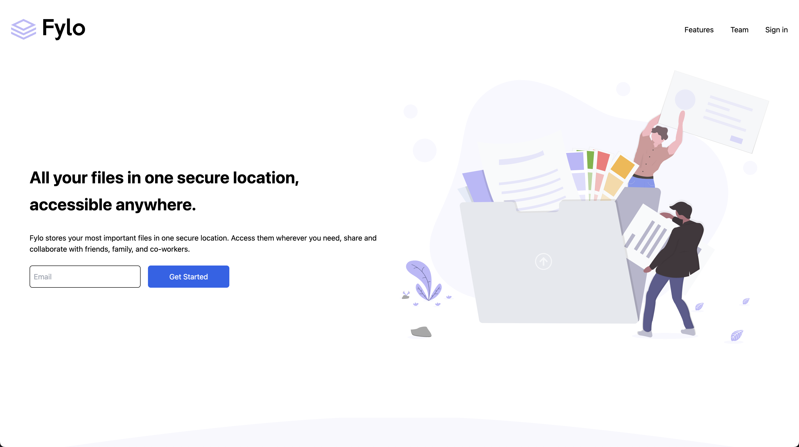

# Frontend Mentor - Fylo landing page with two column layout solution

This is a solution to the [Fylo landing page with two column layout challenge on Frontend Mentor](https://www.frontendmentor.io/challenges/fylo-landing-page-with-two-column-layout-5ca5ef041e82137ec91a50f5). Frontend Mentor challenges help you improve your coding skills by building realistic projects. 

## Table of contents

- [Overview](#overview)
  - [The challenge](#the-challenge)
  - [Screenshot](#screenshot)
  - [Links](#links)
- [My process](#my-process)
  - [Built with](#built-with)
  - [Useful resources](#useful-resources)
- [Author](#author)

## Overview

### The challenge

Users should be able to:

- View the optimal layout for the site depending on their device's screen size
 
### Screenshot

### Links

- Solution URL: [Add solution URL here](https://your-solution-url.com)
- Live Site URL: [https://mohamedsalehjr.github.io/Fylo-landing-page-with-two-column-layout/]

## My process

### Built with

- Semantic HTML5 markup
- Tailwind CSS
- Flexbox
- Sass

## Author

- Website - [Mohamed Saleh](https://mohamedsalehdev.info/)
- Frontend Mentor - [@mohamedsalehjr](https://www.frontendmentor.io/profile/MohamedSalehjr)

